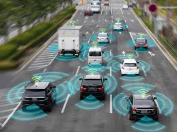

# Computer Vision

[Computer Vision (CV)](https://en.wikipedia.org/wiki/Computer_vision) is an interdisciplinary scientific field that deals with how computers can gain high-level understanding from digital images or videos so as to automate and possibly perfect the tasks that the human visual system can do.

### Why Computer Vision?

Take prison CCTV operators for instance, they sit long hours in CCTV rooms monitoring prisoners' behavior and movements to ensure timely responses from prison guards in the event that chaos or escape occur.
This however can be physically draining and isn't as timely as a smoke detector. What happens when one (or more) CCTV operator doses off? Or goes to answer nature's call? Or goes to pick a coffee? These are small discrepancies that can be exploited in the shortest time and before you know it, a prison break has happened. This is where computer vision comes in. With this technology, AI agents can be trained to detect any suspicious inmates' behavior using footage from the hundreds of installed CCTVs and alert the prison authorities ahead of time. 

### Applications of Computer Vision

* [Self-driving cars]()
* Facial Recognition Software
* Defect-detection in Manufacturing

And many more..